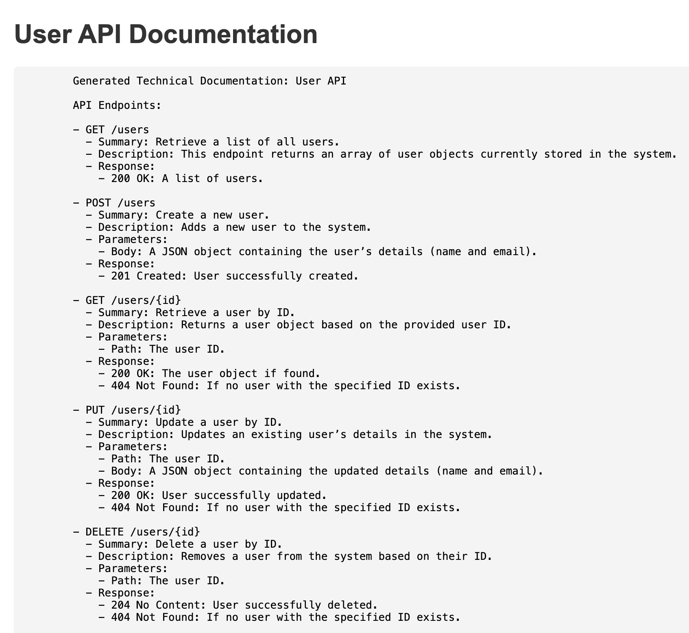

# Automated Technical Documentation Generator
Swagger is a tool used to describe and document RESTful APIs. It usually contains details about available endpoints, request parameters, and response formats. The documentation can be in JSON or YAML format.

Unit tests are scripts written to test small pieces of code, such as individual functions or endpoints, to make sure they work as expected.

This repository has a solution for automating the generation of swagger technical documentation and unit test cases into comprehensive technical documents using ChatGPT to help new developers quickly understand a codebase or project.

***

## Project Structure
Here’s a high-level view of the files in the project:

- `app.js` : The main Express server that handles API routes and serves the documentation.
- `generateDocumentation.js` : A script that generates documentation by integrating Swagger API docs and unit tests.
- `index.js` : The entry point for the project that configures the server and triggers documentation generation.
- `swagger.json` : A Swagger file containing API definitions (endpoints, methods, responses).
- `swaggerParser.js` : A utility file for parsing the Swagger documentation.
- `unitTestParser.js` : A utility file for parsing unit tests.
- `userTest.js` : Unit tests that verify the functionality of the User API.
- `index.html` : A frontend file to display the generated documentation.

***

## Dependencies Installed

- `openai` : To interact with the ChatGPT API.
- `swagger-parser` : To parse Swagger documentation.
- `axios` : To handle HTTP requests, if needed.
- `fs-extra` : For file system operations.
- `dotenv` : Loads environment variables from a `.env` file into `process.env`, keeping sensitive data like API keys secure.
- `express` : Sets up the HTTP server, routing, and middleware to handle API requests and serve frontend pages.
- `jest` : A testing framework

***

## Steps to setup the project

### Step 1: Fork and Clone the repository
Fork the repository and then clone the project from your version control system (e.g., GitHub) using the following command:
```bash
git clone <repository_url>
```

### Step 2: Install all the necessary dependencies
Navigate to the project directory and run:

```bash
npm install
```
This will install all required Node.js packages (like Express, Swagger parser, etc.).

### Step 3: Set up OpenAI API key
You need an OpenAI API key to use the GPT model for generating documentation. Create a `.env` file in the root directory and add your OpenAI API key like this:

```bash
OPENAI_API_KEY=your_openai_api_key
```

### Step 4: Run the project
Start the server using:
```bash
npm start
```
The API and the documentation generator will now be running on port 3000.

*** 

## File Breakdown
### `app.js` – Express Server Setup
The app.js file sets up the Express server that handles:
- Serving the frontend documentation page (/docs).
- Providing REST API routes for CRUD operations on users.
- Handling requests to generate documentation dynamically.

#### Key parts:
- **`GET /docs` :** Serves the index.html file, which is the frontend page where generated documentation is displayed.
- **`GET /api/docs` :** This endpoint generates the API documentation dynamically and returns it as JSON.
- **`CRUD API` :** Implements user management API endpoints (/api/users).
Example:

```javascript
app.get('/api/users', (req, res) => {
    res.status(200).json(users);
});
```

### `generateDocumentation.js` – Documentation Generator
This script integrates with OpenAI’s GPT model to generate technical documentation based on the Swagger file and the unit test cases.

#### Key parts:

- **`parseSwagger` :** Reads and parses the Swagger documentation.
- **`parseUnitTests` :** Reads and extracts unit test cases.
- **OpenAI API Call :** Sends the Swagger and unit test data to OpenAI's GPT-3.5 model to generate clear, readable documentation for developers.

#### Main workflow:
```javascript
async function generateDocumentation(swaggerFilePath, testFilePath, apiKey) {
    // Parse Swagger and Unit Test files
    const swaggerData = await parseSwagger(swaggerFilePath);
    const testCases = parseUnitTests(testFilePath);

    // Generate documentation using OpenAI GPT model
    const completion = await openai.completions.create({
        model: 'gpt-3.5-turbo',
        prompt: `Generate technical documentation for the following API...`,
        max_tokens: 200,
    });
    
    return completion.choices[0].text.trim();
}
```

### `index.js` – Entry Point
This file configures the server and triggers documentation generation when the server starts. It also logs the generated documentation to the console and serves it to the frontend.

#### Key parts:
- **generateDocs() :** Calls the generateDocumentation() function and logs the result.
- **Server Start :** Starts the server on port 3000 and serves the generated documentation to the frontend.
```javascript
app.listen(PORT, () => {
    console.log(`Server is running on port ${PORT}`);
    generateDocs();
});
```

### `swagger.json` – Swagger API Definitions
This file contains the definitions for the User API, including the endpoints (GET, POST, PUT, DELETE), parameters, and expected responses.

Example structure:

```json
{
  "paths": {
    "/users": {
      "get": {
        "summary": "Get all users",
        "responses": {
          "200": {
            "description": "A list of users."
          }
        }
      },
      "post": {
        "summary": "Create a new user",
        "parameters": [ ... ]
      }
    }
  }
}
```

### `swaggerParser.js` – Swagger Parser
This utility script parses the Swagger documentation file (swagger.json). It uses the Swagger parser library to extract the API information, which is then used to generate documentation.

#### Key part:
```javascript
const api = await SwaggerParser.parse(swaggerFilePath);
return api;
```

### `unitTestParser.js` – Unit Test Parser
This script reads the unit test file (userTest.js) and extracts test case descriptions using regular expressions. These test cases are included in the generated documentation to show how the API is tested.

#### Key part:
```javascript
const testCases = fileContent.match(/it\(['"`](.*?)['"`],/g).map(match => match.slice(4, -2));
```

### `userTest.js` – Unit Test Cases
This file contains unit tests for the User API. It uses supertest to simulate API requests and verify that the endpoints work as expected.

Example:

```javascript
it('should get all users', async () => {
    const response = await request(app).get('/api/users');
    expect(response.status).toBe(200);
    expect(Array.isArray(response.body)).toBe(true);
});
```

### `index.html` – Frontend to Display Documentation
This HTML file is served when the user accesses /docs in their browser. The frontend uses JavaScript to fetch the generated documentation from the /api/docs endpoint and displays it in a `<pre>` tag.

#### Key part:
```javascript
fetch('/api/docs')
    .then(response => response.json())
    .then(data => {
        if (data.documentation) {
            container.innerHTML = `<pre>${data.documentation}</pre>`;
        } else {
            container.innerHTML = 'No documentation available';
        }
    });
```

## How the Documentation Generation Works
When you run the server and navigate to /docs, here’s what happens:

- **Server Start :** The server starts on port `3000` and immediately calls `generateDocs()`.
- **Documentation Generation :** The `generateDocumentation.js` script reads the Swagger file (`swagger.json`) and the unit tests (`userTest.js`). It then uses OpenAI’s GPT model to generate a detailed technical document.
- **Serving the Documentation :** The `/api/doc`s endpoint returns the generated documentation as JSON. The frontend (loaded from `index.html`) fetches this JSON and displays the documentation in the browser.

## Example Output
Once the system is running, and you visit /docs, you will see the following output in your browser

